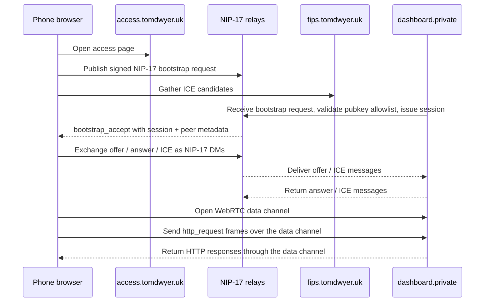

# Ops Dashboard Deployment: NIP-17 Relay Signaling + Direct WebRTC Peer

This is the current public access shape.
The browser authenticates with NIP-17, uses STUN for ICE discovery, and
then connects directly to the backend WebRTC peer. No TURN server is used.

The old HTTP bootstrap and signalling routes still exist for compatibility
and debugging, but the default browser access page now uses NIP-17 relay
signalling and direct WebRTC peer setup.

## Topology

| Machine / role | Hostname | WireGuard IP | Public port(s) | Services |
| --- | --- | --- | --- | --- |
| cPanel redirector | `ops.tomdwyer.uk` | none | `443` | redirect only |
| Public access page | `access.tomdwyer.uk` | none or provider-specific | `443` | static HTML/JS front door |
| STUN server | `fips.tomdwyer.uk` | none | `3478/udp` | STUN |
| Dashboard host / backend peer | `dashboard.private` | `10.44.0.2` | private only | ops-dashboard, NIP-17 relay controller, WebRTC peer, local HTTP runtime |

## Request flow



## What runs where

### cPanel host

- Redirects `ops.tomdwyer.uk` to the public access page.
- Does not run the dashboard or signalling logic.

### Public access page host

- Serves the browser UI for NIP-07, Amber / Nostr Connect, and `nsec` sign-in.
- Runs only client-side logic.
- Publishes the bootstrap request over NIP-17 relays.
- Uses STUN for ICE candidate discovery.
- Does not need to terminate the data plane itself.

### Backend host

- Verifies the signed NIP-17 bootstrap event.
- Enforces the pubkey allowlist.
- Issues access sessions.
- Listens for relayed offer / ICE messages.
- Acts as the WebRTC peer for the browser.
- Proxies request frames into the private dashboard runtime.
- Can stay private on WireGuard or localhost for its internal HTTP runtime.

## Environment

On the backend host:

```bash
APP_HOST=10.44.0.2
PORT=4080
BACKEND_BASE_URL=http://10.44.0.2:4080
NOSTR_RELAY_URLS=wss://relay.damus.io,wss://relay.primal.net
FIPS_STUN_URL=stun:fips.tomdwyer.uk:3478
```

On the public access page host, only static serving is required.

If you want the app to stay loopback-only for local dev, leave those unset.

## Notes

- `ops.tomdwyer.uk` is only a redirect front door.
- `access.tomdwyer.uk` is the public sign-in page.
- `fips.tomdwyer.uk` provides STUN for ICE discovery.
- NIP-17 relays carry bootstrap and signalling.
- The browser and backend use WebRTC data channels for the session transport.
- TURN is intentionally not used.
- The dashboard host stays private; the browser never needs direct HTTP access to it.
- Amber / Nostr Connect works as a browser sign-in path on Android Firefox.
- The browser access page also supports NIP-07 and pasted `nsec`.
- The dashboard root and project pages require an active access session cookie.

That means the cleanest shape is:

`phone -> access.tomdwyer.uk -> NIP-17 relays -> STUN -> direct WebRTC -> dashboard host`

## Exact deployment checklist

### 1) DNS

- Point `access.tomdwyer.uk` at the public HTTPS host for the access page.
- Keep `ops.tomdwyer.uk` on cPanel as a redirect or simple landing page.
- Point `fips.tomdwyer.uk` at the STUN server.

### 2) Backend host

- Run the Node app on the dashboard host.
- Bind it privately, for example:
  - `APP_HOST=10.44.0.2`
  - `PORT=4080`
  - `BACKEND_BASE_URL=http://10.44.0.2:4080`
- Keep the host otherwise closed to the public internet.
- Make sure the backend process can reach the configured Nostr relays.

### 3) STUN

- Run a STUN server at `fips.tomdwyer.uk`.
- Ensure UDP/3478 is reachable from browsers.
- Keep it separate from the dashboard host.

### 4) Public access page

- Host the access page on `access.tomdwyer.uk`.
- Serve only HTML/JS/CSS for the bootstrap UI.
- The page should:
  - sign with NIP-07, Amber / Nostr Connect, or `nsec`
  - publish the signed bootstrap request to relays
  - gather ICE candidates with STUN
  - auto-connect the WebRTC data channel after bootstrap

### 5) Health checks

- Verify `https://access.tomdwyer.uk/` returns the access page.
- Verify the backend can publish to and receive from the configured relays.
- Verify `curl https://access.tomdwyer.uk/` does not expose the dashboard without auth.
- Verify the dashboard host is not publicly reachable except through its intended private network.

## cPanel handoff snippet

If cPanel is only a front door, use a redirect instead of a reverse proxy.

`index.php` on cPanel:

```php
<?php
$target = 'https://access.tomdwyer.uk' . ($_SERVER['REQUEST_URI'] ?? '/');
header('Location: ' . $target, true, 302);
exit;
```

If you need cPanel to serve a landing page first, link directly to `https://access.tomdwyer.uk/`.

## CORS note

If the browser talks only to the public access origin and the browser uses
NIP-17 relays for signalling, you do not need CORS for the WebRTC access flow.

- Browser origin stays on the public access page domain.
- Signalling is carried by relays, not by browser-to-backend XHR.
- The backend only receives the WebRTC data channel and its own private HTTP runtime traffic.

## Current status

- Working locally: yes
- Access locked down: yes
- NIP-07 sign-in: yes
- Amber / Nostr Connect sign-in: yes
- Optional `nsec` sign-in: yes
- Auto-connect after bootstrap: yes
- NIP-17 relay signalling: yes
- Direct browser-to-backend handoff: yes
- TURN: intentionally not used
